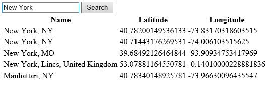

# REST Services Examples
The [Bing Maps REST services](../rest-services/index.md) provide a number of API's which provide several funcationalities:

* Geocode Addresses
* Reverse Geocode locations
* Calculate Directions
* Generate static map images
* Get Traffic incident data
* Get elevation data 

The Bing Map V8 provides a Search, Direction and Traffic modules which wraps several of the API's in the Bing Maps REST services. Not all of the API's are exposed in V8, however even when there is a module, sometimes it is useful to directly access the raw data from the REST services without using the modules. 

## Accessing the REST services from JavaScript

The Bing Maps REST services can be accessed using GET requests with JSONP. The following examples show how to access the Bing Maps REST Location API to geocode a query and display the matching results in a table using different JavaScript frameworks. All of these examples will look like this in a browser.



### Standard JavaScript

REST services can be called using standard JavaScript by simply appending a script tag containing the REST URL to the page.

```
<!DOCTYPE html>
<html>
<head>
    <title></title>
    <meta charset="utf-8" />
    <script type='text/javascript'>
    var BingMapsKey = 'Your Bing Maps Key';
      
    function geocode() {
        var query = document.getElementById('input').value;

        var geocodeRequest = "http://dev.virtualearth.net/REST/v1/Locations?query=" + encodeURIComponent(query) + "&jsonp=GeocodeCallback&key=" + BingMapsKey;

        CallRestService(geocodeRequest, GeocodeCallback);
    }

    function GeocodeCallback(response) {
        var output = document.getElementById('output');

        if (response &&
            response.resourceSets &&
            response.resourceSets.length > 0 &&
            response.resourceSets[0].resources) {

            var results = response.resourceSets[0].resources;

            var html = ['<table><tr><td>Name</td><td>Latitude</td><td>Longitude</td></tr>'];

            for (var i = 0; i < results.length; i++) {
                html.push('<tr><td>', results[i].name, '</td><td>', results[i].point.coordinates[0], '</td><td>', results[i].point.coordinates[1], '</td></tr>');
            }

            html.push('</table>');

            output.innerHTML = html.join('');
        } else {
            output.innerHTML = "No results found.";
        }
    }

    function CallRestService(request) {
        var script = document.createElement("script");
        script.setAttribute("type", "text/javascript");
        script.setAttribute("src", request);
        document.body.appendChild(script);
    }
    </script>
</head>
<body>
    <input type="text" id="input" value="New York" />
    <input type="button" onClick="geocode()" value="Search" /><br />
    <div id="output"></div>
</body>
</html>
```

### jQuery

[JQuery](http://jquery.com) is a very popular JavaScript framework that makes it easier to developer JavaScript that works across different browsers. jQuery provides three of different functions to make HTTP GET requests to services; jQuery.ajax ($.ajax), jQuery.get ($.get) and jQuery.getJSON ($.getJSON). The jQuery.get and jQuery.getJSON function is meant to be a simplified version of the jQuery.ajax function but have less functionality. The jQuery.get and jQuery.getJSON functions do not support cross-domain requests or JSONP whereas the jQuery.ajax function does. In order to make a cross-domain request using the jQuery.ajax function you have to specify that it uses JSONP and set the dataType property to JSONP. 

```
<!DOCTYPE html>
<html>
<head>
    <title></title>
    <meta charset="utf-8" />
      
    <script type='text/javascript' src="http://ajax.aspnetcdn.com/ajax/jQuery/jquery-3.1.1.min.js"></script>
    
    <script type='text/javascript'>
    var BingMapsKey = 'Your Bing Maps Key';
    
    function geocode() {
        var query = document.getElementById('input').value;

        var geocodeRequest = "http://dev.virtualearth.net/REST/v1/Locations?query=" + encodeURIComponent(query) + "&key=" + BingMapsKey;

        CallRestService(geocodeRequest, GeocodeCallback);
    }

    function GeocodeCallback(response) {
        var output = document.getElementById('output');

        if (response &&
            response.resourceSets &&
            response.resourceSets.length > 0 &&
            response.resourceSets[0].resources) {

            var results = response.resourceSets[0].resources;

            var html = ['<table><tr><td>Name</td><td>Latitude</td><td>Longitude</td></tr>'];
            
            for (var i = 0; i < results.length; i++) {
                html.push('<tr><td>', results[i].name, '</td><td>', results[i].point.coordinates[0], '</td><td>', results[i].point.coordinates[1], '</td></tr>');
            }

            html.push('</table>');

            output.innerHTML = html.join('');
        } else {
            output.innerHTML = "No results found.";
        }
    }

    function CallRestService(request, callback) {
        $.ajax({
            url: request,
            dataType: "jsonp",
            jsonp: "jsonp",
            success: function (r) {
                callback(r);
            },
            error: function (e) {
                alert(e.statusText);
            }
        });
    }
    </script>
</head>
<body>
    <input type="text" id="input" value="New York"/>
    <input type="button" onClick="geocode()" value="Search" /><br/>
    <div id="output"></div>
</body>
</html>
```

### Angular 1.0

AngularJS is an open source JavaScript framework that lets you build well structured, easily testable and maintainable front-end applications by using the Model-View-Controller (MVC) pattern. AngularJS has a function $http.jsonp which allows you to easily make JSONP requests. Angular requires that JSONP parameter of the REST request URL point to JSON_CALLBACK.

```
<!DOCTYPE html>
<html>
<head>
    <title></title>
    <meta charset="utf-8" />

    <script type='text/javascript' src="http://ajax.googleapis.com/ajax/libs/angularjs/1.5.1/angular.js"></script>

    <script type='text/javascript'>
    var BingMapsKey = 'Your Bing Maps Key';
    
    var app = angular.module('myApp', []);
    app.controller('GeocodeCtrl', function ($scope, $http) {
        $scope.query = "New York";
        $scope.results = [];

        $scope.geocode = function () {
            var geocodeRequest = "https://dev.virtualearth.net/REST/v1/Locations?query=" + encodeURIComponent($scope.query) + "&jsonp=JSON_CALLBACK&key=" + BingMapsKey;

            $http.jsonp(geocodeRequest)
                .success(function (data, status) {
                    if (data &&
                        data.resourceSets &&
                        data.resourceSets.length > 0 &&
                        data.resourceSets[0].resources) {

                        $scope.results = data.resourceSets[0].resources;
                    } else {
                        $scope.results = null;
                    }
                }).
                error(function (data, status) {
                    $scope.results = null;
                    alert('error');
                });
        };
    });
    </script>
</head>
<body>
    <div ng-app="myApp" ng-controller="GeocodeCtrl">
        <input type="text" ng-model="query" />
        <input type="button" ng-click="geocode()" value="Search" />
        <table>
            <tr>
                <th>Name</th>
                <th>Latitude</th>
                <th>Longitude</th>
            </tr>
            <tr ng-repeat="result in results">
                <td>{{result.name}}</td>
                <td>{{result.point.coordinates[0]}}</td>
                <td>{{result.point.coordinates[1]}}</td>
            </tr>
        </table>
    </div>
</body>
</html>
```

### Angular 1.6

Angular 1.6 has changed how it handles JSONP. First off you need to white list the Bing Maps REST Services in your app config. Additionally, instead of using success and error functions, Angular 1.6 now uses a then function. Finally, the hardcoded "&jsonp=JSON_CALLBACK" value is no longer supported, and instead the jsonpCallbackParam option needs to be used in the request. 

```
<!DOCTYPE html>
<html>
<head>
    <title></title>
    <meta charset="utf-8" />

    <script type='text/javascript' src="http://ajax.googleapis.com/ajax/libs/angularjs/1.6.0/angular.js"></script>

    <script type='text/javascript'>
    var BingMapsKey = 'Your Bing Maps Key';
    
    angular.module('myApp', [])
        .config(function ($sceDelegateProvider) {
            $sceDelegateProvider.resourceUrlWhitelist([
              //Allow same origin resource loads.
              'self',

              //Allow loading from Bing Maps Rest Services.
              'https://dev.virtualearth.net/REST/**'
            ]);
        })
        .controller('GeocodeCtrl', function ($scope, $http) {
            $scope.query = "New York";
            $scope.results = [];

            $scope.geocode = function () {
                var geocodeRequest = "https://dev.virtualearth.net/REST/v1/Locations?query=" + encodeURIComponent($scope.query) + "&key=" + BingMapsKey;

                $http.jsonp(geocodeRequest, { jsonpCallbackParam: 'jsonp' })
                   .then(function (response) {
                       var data = response.data;

                       if (data &&
                         data.resourceSets &&
                         data.resourceSets.length > 0 &&
                         data.resourceSets[0].resources) {

                           $scope.results = data.resourceSets[0].resources;
                       } else {
                           $scope.results = null;
                       }
                   }, function (response) {
                       $scope.results = null;
                       alert('error');
                   });
            };
        });
    </script>
</head>
<body>
    <div ng-app="myApp" ng-controller="GeocodeCtrl">
        <input type="text" ng-model="query" />
        <input type="button" ng-click="geocode()" value="Search" />
        <table>
            <tr>
                <th>Name</th>
                <th>Latitude</th>
                <th>Longitude</th>
            </tr>
            <tr ng-repeat="result in results">
                <td>{{result.name}}</td>
                <td>{{result.point.coordinates[0]}}</td>
                <td>{{result.point.coordinates[1]}}</td>
            </tr>
        </table>
    </div>
</body>
</html>
```

## Examples

* [Elevation Profiles](../v8-web-control/elevation-profiles.md)

## Related Topics

* [Directions Module](../v8-web-control/directions-module.md)
* [Search Module](../v8-web-control/search-module.md)
* [Traffic Module](../v8-web-control/traffic-module.md)
* [PointCompression Class](../v8-web-control/pointcompression-class.md)