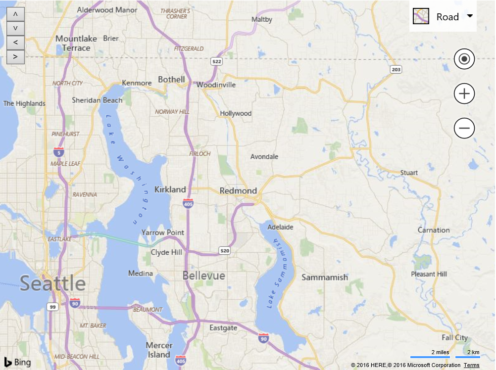

# Simple Static Overlay
This example creates a simple overlay that consists of 4 buttons that allow you to pan the map in different directions. 

```
<!DOCTYPE html>
<html>
<head>
    <title></title>
    <meta charset="utf-8" />
	<script type='text/javascript'>
    var map;

    function GetMap()
    {
        map = new Microsoft.Maps.Map('#myMap', {});

        //Define a custom overlay class that inherts from the CustomOverlay class.
        PanningOverlay.prototype = new Microsoft.Maps.CustomOverlay({ beneathLabels : false });

        //Define a constructor for the custom overlay class.
        function PanningOverlay() {
            this.panUpBtn = document.createElement('input');
            this.panUpBtn.type = 'button';
            this.panUpBtn.value = '˄';
            this.panUpBtn.onclick = function () {
                panMap('up');
            };

            this.panDownBtn = document.createElement('input');
            this.panDownBtn.type = 'button';
            this.panDownBtn.value = '˅';
            this.panDownBtn.onclick = function () {
                panMap('down');
            };

            this.panLeftBtn = document.createElement('input');
            this.panLeftBtn.type = 'button';
            this.panLeftBtn.value = '<';
            this.panLeftBtn.onclick = function () {
                panMap('left');
            };

            this.panRightBtn = document.createElement('input');
            this.panRightBtn.type = 'button';
            this.panRightBtn.value = '>';
            this.panRightBtn.onclick = function () {
                panMap('right');
            };
        }

        //Implement the onAdd method to set up DOM elements, and use setHtmlElement to bind it with the overlay.
        PanningOverlay.prototype.onAdd = function () {
            //Create a div that will hold pan buttons.
            var container = document.createElement('div');
            container.appendChild(this.panUpBtn);
            container.appendChild(this.panDownBtn);
            container.appendChild(this.panLeftBtn);
            container.appendChild(this.panRightBtn);
            container.style.position = 'absolute';
            container.style.top = '10px';
            container.style.left = '10px';
            this.setHtmlElement(container);
        };

        //Implement the new custom overlay class.
        var overlay = new PanningOverlay();

        //Add the custom overlay to the map.
        map.layers.insert(overlay);
    }

    function panMap(dir) {
        var dx = 0, dy = 0;
        switch (dir) {
            case 'up':
                dy = -30;
                break;
            case 'down':
                dy = 30;
                break;
            case 'left':
                dx = -30;
                break;
            case 'right':
                dx = 30;
                break;
        }

        var cp = map.tryLocationToPixel(map.getCenter());
        cp.x += dx;
        cp.y += dy;

        map.setView({ center: map.tryPixelToLocation(cp) });
    }
    </script>
    <script type='text/javascript' src='http://www.bing.com/api/maps/mapcontrol?callback=GetMap&key=[YOUR_BING_MAPS_KEY]' async defer></script>
</head>
<body>
    <div id="myMap" style="position:relative;width:800px;height:600px;"></div>
</body>
</html>
```

Running this code will display 4 arrow buttons in the top left corner of the map. When pressed they will pan the map by 30 pixels in the specified direction.

