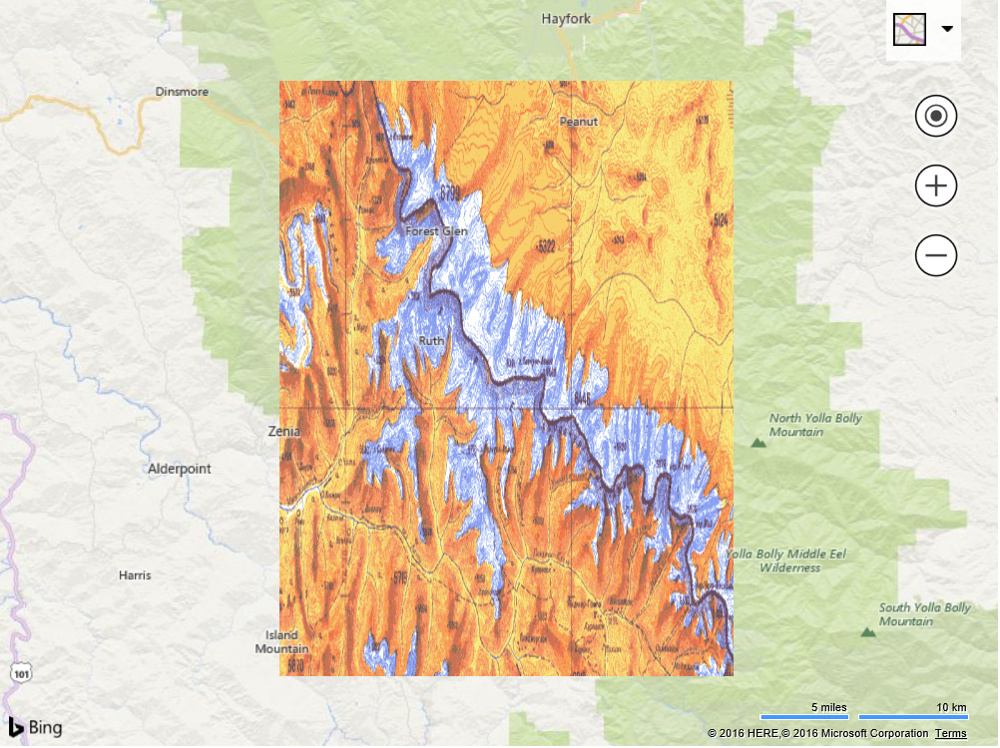

# Topography Overlay
This example creates a custom overlay that streaches an image such that the corners are binded to a bounding box on the map. This is useful when you want to overlay a georeferenced image on that map without having to turn it into a tile layer. Some common scenarios where this might be used is when overlaying images of floor plans, campus maps, or individual satellite images on the map. 

```
<!DOCTYPE html>
<html>
<head>
    <title></title>
    <meta charset="utf-8" />
	<script type='text/javascript'>
    var map;

    function GetMap()
    {
        map = new Microsoft.Maps.Map('#myMap', {
            credentials: 'Your Bing Maps Key',
            center: new Microsoft.Maps.Location(40.25, -123.25),
            zoom: 8
        });

        //Define a custom overlay class that inherts from the CustomOverlay class.
        TopographicOverlay.prototype = new Microsoft.Maps.CustomOverlay();

        //Define a constructor for the custom overlay class.
        function TopographicOverlay(bounds, image) {
            this.bounds = bounds;
            this.image = image;
        }

        //Implement the onAdd method to set up DOM elements, and use setHtmlElement to bind it with the overlay.
        TopographicOverlay.prototype.onAdd = function () {
            //Create an image element that will be used as the overlay.
            img = document.createElement('img');
            img.src = this.image;
            img.style.width = '100%';
            img.style.height = '100%';
            img.style.position = 'absolute';
            this.setHtmlElement(img);
        };

        //Implement the onLoad method to perform custom operations of rendering the DOM element.
        TopographicOverlay.prototype.onLoad = function () {
            repositionOverlay();

            //Update the position of the image when the view changes.
            Microsoft.Maps.Events.addHandler(map, 'viewchange', function () {
                repositionOverlay();
            });
        };

        function repositionOverlay() {
            //Streach and position the image based on the bounding box pixel coordinates.
            var topLeft = map.tryLocationToPixel(bounds.getNorthwest(), Microsoft.Maps.PixelReference.control);
            var bottomRight = map.tryLocationToPixel(bounds.getSoutheast(), Microsoft.Maps.PixelReference.control);

            img.style.left = topLeft.x + 'px';
            img.style.top = topLeft.y + 'px';
            img.style.width = (bottomRight.x - topLeft.x) + 'px';
            img.style.width = (bottomRight.x - topLeft.x) + 'px';
            img.style.height = (bottomRight.y - topLeft.y) + 'px';
        }

        //The bounding box and url for the image to overlay.
        var bounds = Microsoft.Maps.LocationRect.fromCorners(new Microsoft.Maps.Location(40.5, -123.5), new Microsoft.Maps.Location(40, -123));
        var imageSrc = 'https://bingmapsisdk.blob.core.windows.net/isdksamples/topographicMap.gif';

        //Implement the new custom overlay class. 
        var overlay = new TopographicOverlay(bounds, imageSrc);

        //Add the custom overlay to the map.
        map.layers.insert(overlay);
    }
    </script>
    <script type='text/javascript' src='http://www.bing.com/api/maps/mapcontrol?callback=GetMap' async defer></script>
</head>
<body>
    <div id="myMap" style="position:relative;width:800px;height:600px;"></div>
</body>
</html>
```

Running this code will overlay a topographic image of a mountain range on top of the map. As you pan and zoom you will notice that the corners of the image stay bounded to the specified bounding box and streaches as needed based on zoom level.



[Try it now](http://www.bing.com/api/maps/sdk/mapcontrol/isdk#imageOverlay+JS)